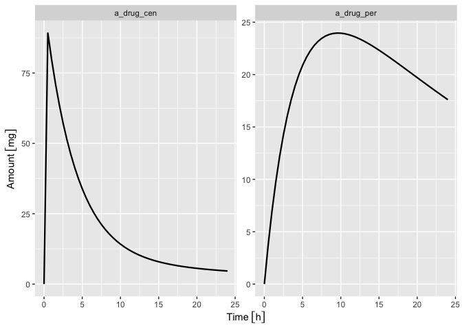

# compphysiol: Computational physiology toolbox


<!-- badges: start -->

[](https://github.com/niklhart/compphysiol-R/actions/workflows/R-CMD-check.yaml)
[](https://app.codecov.io/gh/niklhart/compphysiol-R)

<!-- badges: end -->

`compphysiol` is an R package for computations with physiology-based
models, in particular physiologically-based pharmacokinetic (PBPK)
models. It features a modular object-oriented design and an intuitive
scripting language.

## Installation

You can download the development version of the package on GitHub:

``` r
# install.packages("devtools")
devtools::install_github("niklhart/compphysiol-R")
```

## Citation

See `citation("compphysiol")` for how to cite this package in scientific
work.

## Usage

``` r
library(compphysiol)
```

This example defines and simulates a two-compartment empirical PK model
with unit-aware amounts, volumes, rate constants, and simulation times.

``` r
model <- multiCompModel(ncomp = 2, type = "micro", unit = "mg") |>
    add_dosing(time = 0 [h], amount = 100 [mg], cmt = "cen") |>
    wire(what = "molec")

pars <- parameters(
    kc0 = 0.15 [1/h],
    kcp = 0.08 [1/h],
    kpc = 0.05 [1/h],
    Vcen = 8 [L],
    Vper = 20 [L]
)
```

Simulate the model over 24 hours:

``` r
sim <- simulate(
    model,
    time = seq(0, 24, by = 0.5) [h],
    parameters = pars
)

head(sim$states)
```

         time    a_drug_cen     a_drug_per
    1 0.0 [h]  0.00000 [mg]  0.000000 [mg]
    2 0.5 [h] 89.18255 [mg]  3.731456 [mg]
    3 1.0 [h] 79.62230 [mg]  6.968900 [mg]
    4 1.5 [h] 71.17173 [mg]  9.771207 [mg]
    5 2.0 [h] 63.70065 [mg] 12.190323 [mg]
    6 2.5 [h] 57.09416 [mg] 14.272075 [mg]

``` r
head(sim$observables)
```

         time             Ccen
    1 0.0 [h]  0.000000 [mg/L]
    2 0.5 [h] 11.147819 [mg/L]
    3 1.0 [h]  9.952788 [mg/L]
    4 1.5 [h]  8.896466 [mg/L]
    5 2.0 [h]  7.962581 [mg/L]
    6 2.5 [h]  7.136770 [mg/L]

The returned state and observable tables keep their units. If `ggplot2`,
`reshape2`, and `units` are installed, they can be plotted directly:

``` r
library(ggplot2)
library(units)

states_long <- reshape2::melt(
    sim$states,
    id.vars = "time",
    variable.name = "state",
    value.name = "amount"
)

ggplot(states_long, aes(x = time, y = amount)) +
    geom_line(linewidth = 0.8) +
    facet_wrap(vars(state), scales = "free_y") +
    labs(x = "Time", y = "Amount")
```



## AI Agent Guidance

This repository intentionally includes an AI-agent guidance file
`AGENTS.md` and project-specific Codex skills. These files document
repository conventions, modeling vocabulary, testing expectations, and
review workflows for AI-assisted development.
